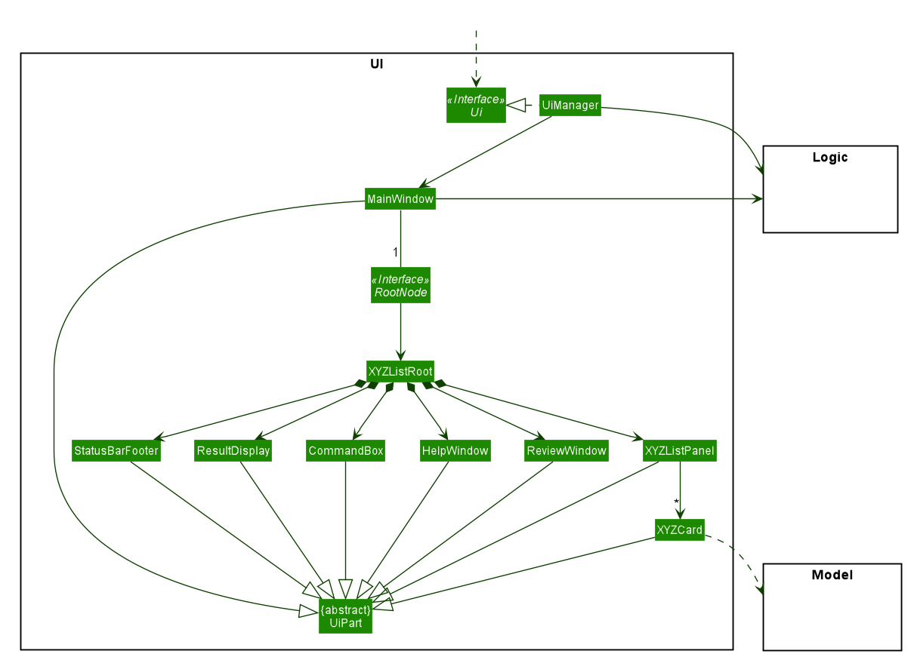
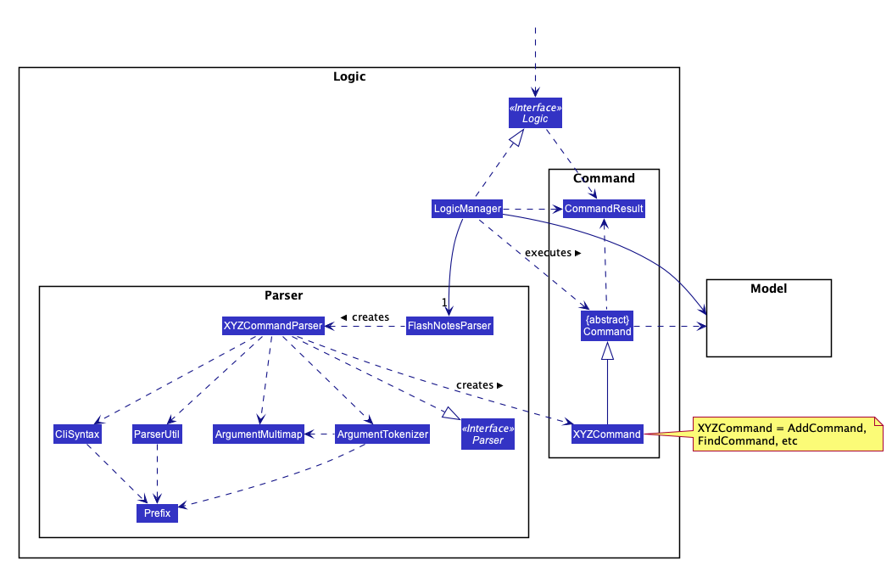
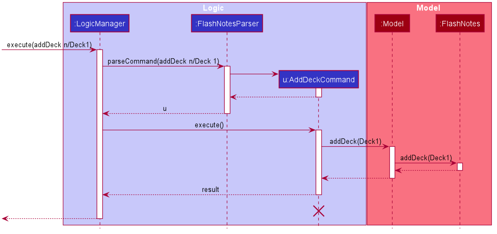
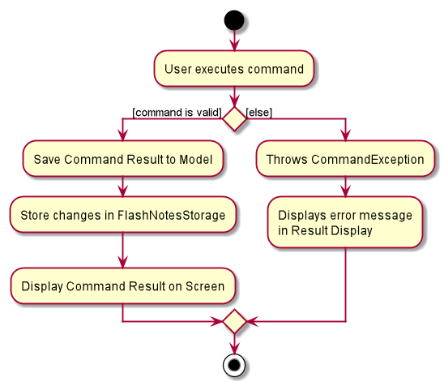

* Table of Contents
{:toc}
--------------------------------------------------------------------------------------------------------------------

### UI component

**API** :
[`Ui.java`](https://github.com/se-edu/addressbook-level3/tree/master/src/main/java/seedu/address/ui/Ui.java)

The UI consists of a `MainWindow` which acts as a stage, and the `MainWindow` that references a `RootNode` to display the scene.
The Root Node contains the scene, which is composed of UI parts like`CommandBox`, `ResultDisplay`, `PersonListPanel`, `StatusBarFooter` etc. All these, including the `MainWindow`, inherit from the abstract `UiPart` class.

The `UI` component uses JavaFx UI framework. The layout of these UI parts are defined in matching `.fxml` files that are in the `src/main/resources/view` folder. For example, the layout of the [`MainWindow`](https://github.com/se-edu/addressbook-level3/tree/master/src/main/java/seedu/address/ui/MainWindow.java) is specified in [`MainWindow.fxml`](https://github.com/se-edu/addressbook-level3/tree/master/src/main/resources/view/MainWindow.fxml)

The `UI` component,

* Executes user commands using the `Logic` component.
* Listens for changes to `Model` data so that the UI can be updated with the modified data.
--------------------------------------------------------------------------------------------------------------------

### Logic component

**API** :
[`Logic.java`](https://github.com/se-edu/addressbook-level3/tree/master/src/main/java/seedu/flashnotes/logic/Logic.java)

1. `Logic` uses the `FlashNotesParser` class to parse the user command.
1. This results in a `Command` object which is executed by the `LogicManager`.
1. The command execution can affect the `Model` (e.g. adding a flashcard).
1. The result of the command execution is encapsulated as a `CommandResult` object which is passed back to the `Ui`.
1. In addition, the `CommandResult` object can also instruct the `Ui` to perform certain actions, such as displaying help to the user.
--------------------------------------------------------------------------------------------------------------------

### Create Deck feature

#### Implementation

`FlashNotes` supports the creation of new Decks. It extends `ReadOnlyFlashNotes`, which stores internally as an `UniqueDeckList` and a `UniqueCardList`. Additionally, it implements the following operations:

* `Flashnotes#addDeck()` — Add a new Deck with a unique deck name.

`Model` interface depends on  `Flashnotes#addDeck()` to support functionality of `Model#addDeck()`.

##### Given below is an example usage scenario.

Step 1. The user launches the application for the first time. The `FlashNotes` will be initialized with the stored FlashNote state.

Step 2. The user executes `addDeck n/Deck1` command to add a new Deck in the FlashNotes. The `addDeck` command calls `Model#addDeck()`, which executes the command and saves it to `FlashNotes`.

Step 3. The user is now able to see the new `Deck1` added. The `add` command also calls `Model#commitAddressBook()`, causing another modified address book state to be saved into the `addressBookStateList`.

:information_source: **Note:** If the deck already exists (duplicate deck name), it will throw a `DuplicateDeckException`, so the newly created deck will not be saved into the `FlashNotes`. The implementation details are in UniqueDeckList.

##### Corresponding sequence diagram for `AddDeck`:

The following sequence diagram shows how AddDeck operation works:

:information_source: **Note:** The lifeline for `addDeckCommand` should end at the destroy marker (X) but due to a limitation of PlantUML, the lifeline reaches the end of diagram.

The following general activity diagram summarizes what happens when a user executes a new command:

#### Design consideration:

##### 2 possible designs for Adding Deck

* **Alternative 1 (current choice):** Contain a list of deck names and uses it to search up relevant flashcards.
  * Pros: Easy to implement. Suitable at this current stage because there is at most 4 cards shown at any point in time on screen. Over-optimisation is unnecessary.
  * Cons: May have performance issues if trying to find a large number cards contained by the deck.

* **Alternative 2:** Store Flashcards within deck.
  * Pros: Performance will be better than searching through all current flashcards to find the relevant cards to be initialized in the deck.
  * Cons: We must ensure that the implementation of each deck contains a direct reference to the flashcards.

## **Appendix: Requirements**

### Product scope

**Target user profile**:

* NUS FASS student who likes to write down lecture notes
* practices active learning techniques via flash cards
* prefer desktop apps over other types
* can type fast
* prefers typing to mouse interactions
* is reasonably comfortable using CLI apps

**Value proposition**: manage, read and create flashcards faster than a typical mouse/GUI driven app

### User stories

Priorities: High (must have) - `* * *`, Medium (nice to have) - `* *`, Low (unlikely to have) - `*`

| Priority | As a …​                                    | I want to …​                     | So that I can…​                                                        |
| -------- | ------------------------------------------ | ------------------------------ | ---------------------------------------------------------------------- |
| `* * *`  | new user                                   | see usage instructions         | refer to instructions when I forget how to use the App                 |
| `* * *`  | user                                       | add a new card                 |                                                                        |
| `* * *`  | user                                       | delete a card                  | remove entries that I no longer need                                   |
| `* * *`  | user                                       | find a card by keyword         | locate certain cards without having to go through the entire list      |
| `* *`    | user                                       | hide old cards                 | clear clutter when there are too many cards in the deck                |
| `*`      | user with many related cards in the app    | nest the card decks by tags    | locate a cards of the same group easily when reviewing                               |

*{More to be added}*

### Use cases

####**Use case: UC01 - Review cards**

####Precondition: Cards that will be reviewed are already selected; User sees the full list of cards in the given deck.

**MSS:**

1. Deck selects the relevant number of cards from current storage and displays it.
1. User start reviewing using the cards that are currently being displayed in deck.
1. Start review in a different window.
1. Card appears.
1. Card flipped.
1. Card marked as correct or wrong.
1. Repeat steps 4 to 6 until Deck ends.
1. Show Review statistics.
1. Close Window.
1. Return to list view of deck in the main window.

    Use case ends.

**Extension:**

* 6a. User marks the card as correct.
   * 6a.1. System shows next card.  
   Use case resumes from Step 4.

* 6b. User marks card as wrong.
   * 6b.1. System adds card back into the queue.
   * 6b.2. System shows the next card.  
   Use case resumes from Step 4.

* *User ends the review session prematurely.
    * *a. Review statistics screen not shown.
    * *b. Review statistics not updated in the deck list.  
    Use case resumes from Step 10.

####**Use case: UC02 - Create new Deck**
#####Precondition: User is in the Home Screen, and is not in review mode.

**MSS:**

1. User enters command to create a new deck.
1. User enters empty deck view.
1. User returns to main screen.

    Use Case Ends.

**Extension:**

* 1a. Deck name is a duplicate of existing decks.
    * 1a.1. Raise error and stay in Home Screen.  
    Use case ends.
    
* 2a. User creates new card in deck view (UC04).
    * 2a.1.  Card tagged with the deck name.  
    Use case resumes from Step 3.

* 2b. User deletes card (UC03).  
    Use case resumes from Step 3.

* 2c. User edits card (UC05).  
    Use case resumes from Step 3.

####**Use case: UC03 - Delete a Card**
#####Precondition: User is in the Home Mode, and is not in review mode.

**MSS**

1. User requests to list cards.
1. Flashnotes shows a list of cards.
1. User requests to delete a specific card in the list.
1. Flashnotes deletes the card.

    Use case ends.

**Extensions**

* 2a. The list is empty.
    Use case ends.
    
* 3a. The given index is invalid.
    * 3a.1. Flashnotes shows an error message.  
    Use case resumes at Step 2.

####**Use case: UC04 - Add a card**
#####Precondition: Must be inside the deck view.

**MSS**

1. User add card.
1. Flashnotes adds the card.

    Use case ends.

**Extensions**

* 2a. There is a duplicate card.
    * 2a.1. Flashnotes shows an error message.  
    Use case resumes at Step 2.

####**Use case: UC05 - Edit a card**
#####Precondition: Must be inside the deck mode.

**MSS**

1. User requests to list cards.
1. Flashnotes shows a list of cards.
1. User requests to edit a specific card in the list.
1. Flashnotes edits the card.

    Use case ends.

**Extensions**

* 2a. The list is empty.
    Use case ends.
* 3a. The given index is invalid.
    * 3a.1. Flashnotes shows an error message.
    Use case resumes at step 2.

#####**Use case: UC06 - Open Existing Deck**
#####Precondition: User is in the Home Mode, and is not in review mode.

**MSS**

1. User filters all cards belonging to a particular deck.
1. Flashnotes shows a list of cards using the deck mode.

    Use case ends.

**Extensions**

* 1a. User enters a tag that is not found.
    * 1a.1. Flashnotes returns empty card list.  
    Use case ends.

####**Use case: UC07 - Delete current Deck**
#####Precondition: User is in the Home Mode, and is not in review mode. If in deck view mode, cannot delete.

**MSS:**

1. User enters command to delete an existing deck.
1. Deck delete success message shown in main screen.

    Use Case ends.

**Extension:**

* 2a. Tries to delete deck.
    * 2a.1 Deck not found.
    * 2a.2 Display Error Message.  
    Use Case ends.

####**Use case: UC07 - Rename current Deck**
#####Precondition: User is in the Home mode, and is not in review mode.

**MSS:**

1. User enters command to rename an existing deck.
1. Deck renamed with success message shown.
1. User returns to the main screen.

    Use Case ends.

**Extension:**

* 2a. User renames deck to the same name as an already existing deck.
    * 2a.1 Error message is shown in the main screen and the deck will not be renamed.   
    Use Case ends.

####**Use case: UC08 - Return to Home mode**
#####Precondition: User is not in Home mode and not in review mode.

**MSS:**

1. User enters Home Command.
1. User returns to main screen.

    Use Case ends.

**Extension:**

* 2a. Already in the Home screen.
    * 2a.1. Return message to remind user.  
    Use Case ends.

### Non-Functional Requirements

1.  Should work on any _mainstream OS_ as long as it has Java `11` or above installed.
2.  Should be able to hold up to 1000 cards without a noticeable sluggishness in performance for typical usage.
3.  A user with above average typing speed for regular English text (i.e. not code, not system admin commands) should be able to accomplish most of the tasks faster using commands than using the mouse.
4.  Searching for a flashcard should not take more than 2 seconds.
5.  The user can directly edit the data file to add or edit flashcards.
6.  The user can import or export the flashcards by adding/copying a new json file with the same name.

### Glossary

* **Mainstream OS**: Windows, Linux, Unix, OS-X
* **Flashcard**: A card with a question and answer, and may contain a tag.
* **Flashnotes**: The software that stores flashcards.
* **Tag**: A note to group cards of a certain category together.
* **Review Mode**: a mode which displays cards from a deck individually in shuffled order.
* **Deck Mode**: A mode which displays a list of cards
* **Home Mode**: A mode which displays a list of decks

--------------------------------------------------------------------------------------------------------------------

## **Appendix: Instructions for manual testing**

Given below are instructions to test the app manually.

:information_source: **Note:** These instructions only provide a starting point for testers to work on;
testers are expected to do more *exploratory* testing.

### Launch and shutdown

1. Initial launch

   1. Download the jar file and copy into an empty folder

   1. Double-click the jar file Expected: Shows the GUI with a set of sample flashcards. The window size may not be optimum.

1. Saving window preferences

   1. Resize the window to an optimum size. Move the window to a different location. Close the window.

   1. Re-launch the app by double-clicking the jar file. 
       Expected: The most recent window size and location is retained.

1. _{ more test cases …​ }

### Deleting a card

1. Deleting a card while all persons are being shown

   1. Prerequisites: List all cards using the `list` command. Multiple cards in the list.

   1. Test case: `delete 1` 
      Expected: First card is deleted from the list. Details of the deleted card shown in the status message. Timestamp in the status bar is updated.

   1. Test case: `delete 0` 
      Expected: No card is deleted. Error details shown in the status message. Status bar remains the same.

   1. Other incorrect delete commands to try: `delete`, `delete x`, `...` (where x is larger than the list size) 
      Expected: Similar to previous.

1. _{ more test cases …​ }

### Finding cards by tag
1. Finding cards via a specific tag

    1. Prerequisites: Flashnotes have cards containing tag 'Singapore' and 'Malaysia'
    1. Test case: `listTags Singapore`  
       Expected: All cards with the tag 'Singapore' will be shown. Cards with tags 'Malaysia' will not be shown.    
    1. Test case: `listTags singapore`  
       Expected: None of the cards are shown (as the keyword is case-sensitive)       
    1. Test case: `listTags Singapore Malaysia`  
       Expected: All cards with the tag 'Singapore' and cards with the tag 'Malaysia' will be shown.

1. _{ more test cases …​ }
