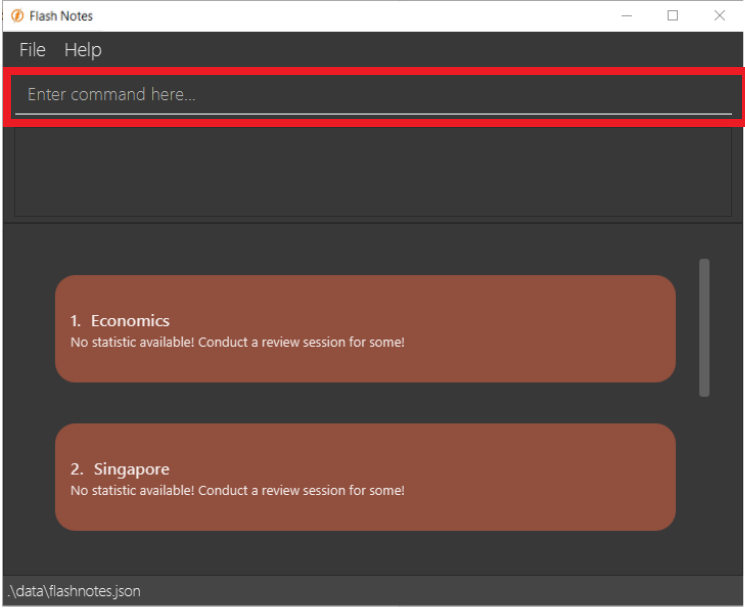
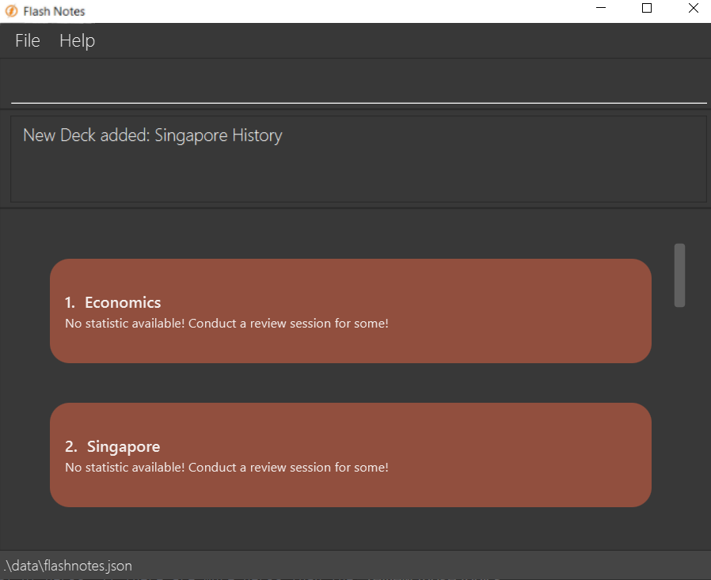
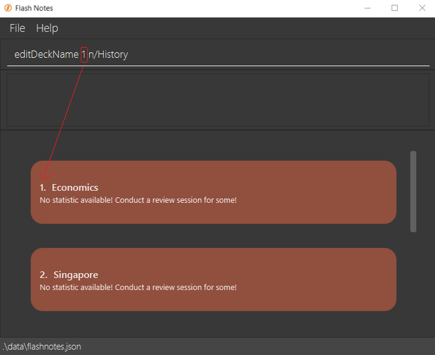
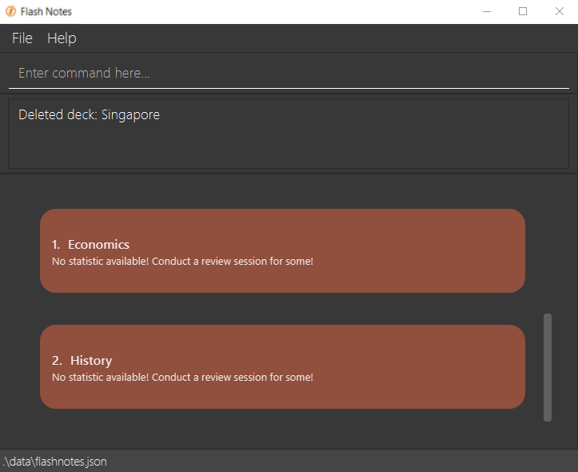
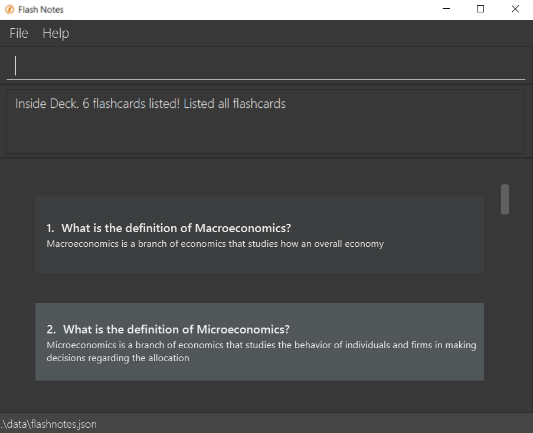
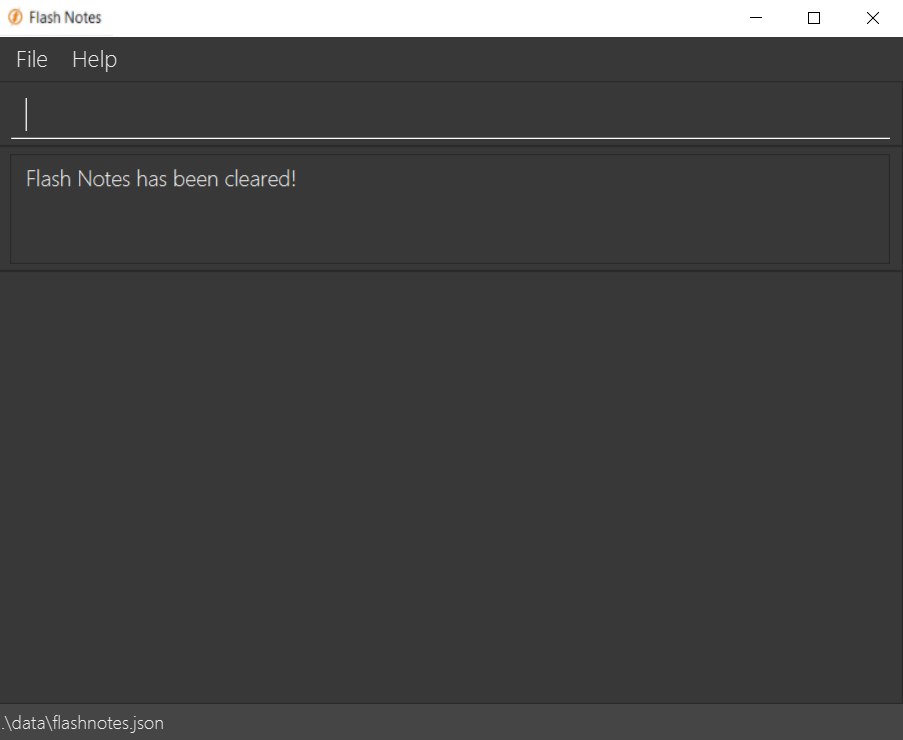
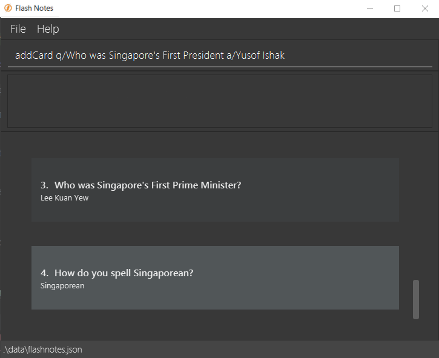
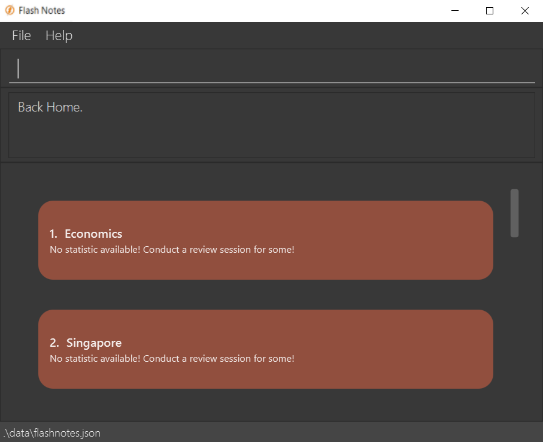

## Introduction
Welcome to the FlashNotes User Guide.

FlashNotes is a **desktop app for flashcards**, built for students who wish to utilise flashcards for studying. FlashNotes is also optimized for use via a Command Line Interface (CLI) while still having the benefits of a Graphical User Interface (GUI). If you can type fast, FlashNotes will be faster than traditional GUI apps.

Flashcards are one of the oldest forms of studying methods, but it is also remarkably difficult to keep track of the vast amount of content to study for. However, with FlashNotes, you can now keep track of your flashcards and their content with ease.
FlashNotes allows you to organise your flashcards by topics or subjects using Decks. 

FlashNotes utilises a studying technique known as [Active Recall](https://en.wikipedia.org/wiki/Active_recall), allowing you to test yourself using flashcards to check if you have mastered your content.
Furthermore, FlashNotes will also keep track of your progress and show you an overview of how well you have mastered your content using flashcards.

This User Guide is for students who have no prior knowledge on how to create and review flashcards. We will teach you how create and manage your flashcards more efficiently, and how to review your flashcards for studying using FlashNotes. 
We will provide you with all the various features and commands of FlashNotes, and its details. 

To get started, head over to the [Quick Start](#quick-start) section.

To see the summary of all our commands, go to the [Command Summary](#command-summary) section.

Here's the Table of Contents for a brief overview of our User Guide, or for you to quickly access other sections of our User Guide.

--------------------------------------------------------------------------------------------------------------------

- Table of Contents
{:toc}

--------------------------------------------------------------------------------------------------------------------

## Glossary

* Flashcard: A flashcard shows a question and the answer to the question.
* Decks: A deck will contain flashcards.
* Index: The number at the start of each deck or flashcard.
* Review: A mode where only the question of the flashcard is shown; the answer will be hidden from you.
* Prefix: A reserved word that needs to be placed before your inputs to indicate the start of your input.
* :information_source:: additional info
* :warning:: warning

## Understanding the 3 different modes:
FlashNotes have 3 different modes that you have to take note of. You will always start in the Main Mode when you open FlashNotes.

Available Modes | Functionality involved | Real Life Representation
--------|------------------ | ------
**Main Mode** | Shows you the decks you have created. | Topics or Subjects of interest
**Card Mode** | Shows you all the list of cards that you have created, or the cards in each deck. | Sub-questions and content knowledge
**Review Mode** | Allows you to review cards by flipping the card between question and answer, and allows you to make the card as correct or wrong. | Revision session

This is a basic overview of what FlashNotes can do for you, but there are more features such as editing decks and cards.

Ready to dominate exams season? Let's get down to work.

--------------------------------------------------------------------------------------------------------------------

## Quick start

1. Ensure you have Java `11` or above installed in your Computer.

1. Download the latest `flashnotes.jar` from [here](https://github.com/AY2021S1-T15-2/tp/releases).

1. Copy the file to the folder you want to use as the _home folder_ for your FlashNotes.

1. Double-click the file to start the app. The GUI similar to the below should appear in a few seconds. Note how the app contains some sample data and the `Command Box` has been identified with the red box. The box is where you can issue all your commands in FlashNotes. 
   

1. Type the command in the command box and press Enter to execute it. e.g. typing help and pressing Enter will open the help window. Some example commands you can try:

   * **`addDeck`**`n/Economics `: create new empty Deck named Economics.

   * **`list`** : list all cards by going inside card mode.

   * **`clear`** : Deletes all cards.

   * **`find`**`question`: Returns all cards with description matching question.

   * **`enterDeck`**`Singapore`: Returns all cards inside the deck 'Singapore'.

   * **`exit`** : Exits the app.

1. After executing each command, a success or failure message will be displayed in the region highlighted in the image below. This will help you to know if you have successfully executed relevant commands, it will also provide additional information on why the command failed, if you provide the correct command prefixes.  
    

1. Refer to the [Features](#main-mode-features) below for details of each command.

--------------------------------------------------------------------------------------------------------------------

## Explanation of Command Formats used in features

**:information_source: Notes about the command format:** 

* Words in `UPPER_CASE` are the inputs to be supplied by you. 
  e.g. in `addCard q/QUESTION`, `QUESTION` is an input which can be used as `add q/What is the question?`.

* Inputs can be in any order. 
  e.g. if the command specifies `q/QUESTION a/ANSWER`, `a/ANSWER q/QUESTION` is also acceptable.

--------------------------------------------------------------------------------------------------------------------

## Main Mode Features

**:information_source: Quick Summary of Main Mode:** 

* Main Mode primarily allows management of flashcard decks.
* In order to manage flashcards directly, you will need to enter card mode using the `enterDeck` Command.

### Entering a specified deck: `enterDeck`

Enters card mode and shows your flashcards within your chosen deck.

Format: `enterDeck [DECKNAME]`

Examples:
* `enterDeck Economics` return cards stored in the deck `Economics`

Outcome expected:

1. Enter the Enter Deck command into the command bar.

1. You will see the list of cards stored in the deck named Economics. The result display will also show the number of cards in the list.

:warning: Things to note:

* The search is **case-sensitive**. e.g. `GET1025` will not match `get1025`
* only **full words will** be matched e.g. `GE` will not match `GET1025`

### Create a new Deck : `addDeck`

Creates a new empty deck and adds to the list of decks displayed.

Format: `addDeck n/DECKNAME`

Examples:
* `addDeck Singapore History` creates an empty deck called `Singapore History`.

Outcome expected:
1. Enter the Add Deck Command into the command bar as per the example.

1. You should see the newly rendered list of decks. If there are more decks than the screen can fit, scroll down to find your newly created deck. It will be the last one in the list.

1. After scrolling down, you will be able to see your newly created deck. It is empty though, waiting for you to fill it up with meaningful flashcards!

:warning: Things to note:

* The deck name is case-sensitive. e.g. future search queries of `GET1025` will not match `get1025`
* If there is a deck that has the same existing case-sensitive name, the deck will not be created because it would be considered a duplicate deck by the system.

### Rename a new Deck : `editDeckName`

Edit a deck name and the tags of all corresponding cards in the deck.

Format: `editDeckName INDEX n/NEWDECKNAME`

Example:
* `editDeckName 1 n/History` will change the name of the deck at index `1` to `History`.

Outcome Expected:

1\. Enter the editDeckName command (`editDeckName 1 n/History`) into the command bar as shown in the example. The name of the deck at index 1 will be edited.

2\. When successful, you will see that the name of the deck at index 1 has been changed to History.

:warning: Things to note:

* Edits the deck at the specified `INDEX`
* The index refers to the index number shown in the currently displayed list of flashcards
* The index **must be a positive integer** 1, 2, 3, …​
* The `NEWDECKNAME` is case-sensitive
* The `NEWDECKNAME` should not be a name that already exists as a deck.

### Delete a new Deck : `deleteDeck`

Deletes the deck and all the associated cards in your specified deck.

Format: `deleteDeck INDEX`

Example:
* `deleteDeck 3` will delete the deck at index 3 and all its corresponding cards.

Outcome Expected:

1\. Enter the deleteDeck command (`deleteDeck 3`) into the command box as shown in the example. The deck at the index 3 will be deleted.

2\. The deck at index 3 has been deleted and you will be shown the remaining set of decks (if any).

:warning: Things to note:

* Deletes the deck at the specified `INDEX`
* The index refers to the index number shown in the currently displayed list of flashcards
* The index **must be a positive integer** 1, 2, 3, …​

### List all flashcards : `list`

Shows a list of all flashcards.

Format: `list`

Outcome Expected:
1. Enter the List Command into the command bar as per the example.

1. You should see the newly rendered list of flashcards. The list contains all flashcards currently stored in FlashNotes irrespective of the deck.

:warning: Things to note:

* Any cards added while in the list mode will be added to the `Default` deck.
* No additional inputs should be added behind the list command.
* Note that starting a review in this screen will not attribute the review results to any deck. It will not be stored at the end of the review session.

### Clear all cards and decks : `clear`

Clears all decks and flashcards from the program.

Format: `clear`

Outcome Expected:
1. Enter the Clear Command into the command bar as per the example.

1. You should now see that FlashNotes is empty.

:warning: Things to note:

* All cards and decks will be cleared, including any revision history.
* No additional inputs should be added behind the clear command.
* There is no undo command available in the system presently. Hence, the clear command is irreversible.

--------------------------------------------------------------------------------------------------------------------

## Card Mode Features

**:information_source: Quick Summary of Card Mode:** 

* Card Mode primarily allows management of flashcards.
* In order to manage decks directly, need to return to main mode via home command.

### Viewing help : `help`

Shows a message explaining how to access the help page.

Format: `help`

Outcome Expected:

1\. The help window will show you the link to our user guide.

### Adding a flashcard : `addCard`

Adds a card to the currently stored notes.

Format: `addCard q/QUESTION a/ANSWER`

Example:
* `addCard q/Who was Singapore's First President? a/Yusok Ishak`

Outcome Expected:

1\. Enter the addCard Command into the command box as shown. The question will precede after the prefix `q/` and the answer will precede after the prefix `a/`. 

2\. When successful, you will see the newly added flashcard at the bottom of the list.

### Editing a flashcard : `editCard`

Edits an existing flashcard in the flashcard deck.

Format: `editCard INDEX [q/QUESTION] [a/ANSWER]`

* Edits the flashcard at the specified `INDEX`. The index refers to the index number shown in the displayed desk list. The index **must be a positive integer** 1, 2, 3, …​
* At least one of the optional fields must be provided.
* Existing values will be updated to the input values.

Examples:
*  `editCard 2 a/Lee Kuan Yew` Edits the answer of the 2nd flashcard to be `Lee Kuan Yew`

Outcome Expected:
- Success message displayed is: `Edited flashcard: Question: When did Singapore gain independence? Answer: LKY Tag: Singapore.`

### Finding flashcards : `find`

Finds flashcards which contain any of the given keywords.

Format: `find KEYWORD [MORE_KEYWORDS]`

* The search is case-insensitive. e.g `test` will match `Test`
* **Only full words will** be matched e.g. `Art` will not match `Artifact`
* Flashcards matching at least one keyword will be returned. (e.g. `Conflict Resolution` will return `Handling Conflict`, `Resolution`)

Examples:
* `find history` returns `History of WWII` and `History of Cuban war of Independence`
* `find Business` returns `Business Management`
* `find conflict resolution` returns `Handling Conflict` and `Resolution`

Outcome Expected:
- Success message displayed is: `3 flashcards found`

### Deleting a flashcard : `deleteCard`

Deletes the specified flashcard from the flashcard deck.

Format: `deleteCard INDEX`

* Deletes the flashcard at the specified `INDEX`.
* The index refers to the index number shown in the currently displayed list of flashcards
* The index **must be a positive integer** 1, 2, 3, …​

Examples:
* `list` followed by `deleteCard 2` deletes the 2nd flashcard from the flashcard deck.
* `find English` followed by `deleteCard 1` deletes the 1st flashcard shown in the results of the `find` command.

Outcome Expected:
- Success message displayed is: `Deleted Flashcard: Question: When did Singapore gain independence? Answer: 9th August 1965 Tag: Singapore.`

### Set card limit for review session : `setReviewLimit`

Sets the maximum number of cards that can be reviewed in a single review session.

Format: `setReviewLimit REVIEW_LIMIT`

* `REVIEW_LIMIT` can be an integer greater than 0
* `REVIEW_LIMIT` can be the string `all`. (case sensitive)
* This review card limit applies to all decks once it is set. 
* This review card limit is remembered by the program. (You do not have to set the card limit 
again after he/she closes and reopens the application)

Examples:
* `setReviewLimit 20` sets a limit of 20 cards per review session.
* `setReviewLimitall` removes the card limit and lets you review all cards in the deck.

Outcome Expected:
- Success message displayed is: `Review card limit successfully updated!`

### Return to Main Mode : `home`

Return to Main mode with list of decks.

Format: `home`

Outcome Expected:
1. Enter the Home Command into the command bar as per the example.

1. You should now see the list of orange decks in the home screen.

:warning: Things to note:

* It can only be activated from the card screen to navigate back to home.
* No additional inputs should be added behind the clear command.

### Exiting the program : `exit`

Exits the program.

Format: `exit`

Outcome Expected:
- Program closes down and saves all current data.

### Saving the data

FlashNotes saves data to the hard disk automatically after any command that changes the data. There is no need to save manually.

### Opens the review mode: `review`

Opens the review mode to display cards one by one so that you can review them.

Format: `review`

Outcome Expected:

* This command is only valid in the card mode.

--------------------------------------------------------------------------------------------------------------------

## Review Mode Features

**:information_source: Quick Summary of Review Mode:** 

* Review Mode primarily allows active flashcards to be used for revision.
* It also provides relevant statistics upon completion of review session.
* Enter Review mode by calling `review` command in card mode.

### Flip a flashcard: `flip`

Flips the flashcard which is being reviewed so that you can view the answer to the question.

Format: `flip`

* Flips the flashcard that is being reviewed to reveal the answer.

Examples:
* `flip` returns `The sea is blue because water absorbs colors in the red part of the light spectrum` 
 which is the answer to the question `Why is the sea blue?`.

Outcome Expected:
- Success message displayed is: `Flipping Flashcard as requested ...`

### Mark a flashcard as correct: `c`

Marks the flashcard that is being reviewed as correct and proceeds to show the next flashcard.

Format: `c`

* Marks flashcard as correct before moving on to show the question of the next flashcard.

Examples:
* `c` returns next card in deck if any.

Outcome Expected:
- Success message displayed is: `Marking Flashcard as correct as requested ...`

### Mark a flashcard as wrong: `w`

Marks the flashcard that is being reviewed as wrong and proceeds to show the next flashcard.

Format: `w`

* Marks flashcard as wrong before moving on to show the question of the next flashcard.

Examples:
* `w` returns next card in deck if any.

Outcome Expected:
- Success message displayed is: `Marking Flashcard as wrong as requested ...`

### End current review session: `endReview`

Ends the current review session and shows review statistics.

Format: `endReview`

Outcome Expected:
- Review Window is closed.

--------------------------------------------------------------------------------------------------------------------

## FAQ

**Q**: How do I transfer my data to another Computer? 
**A**: Install the app in the other computer and overwrite the empty data file it creates with the file that contains the data of your previous FlashNotes home folder. 
**Q**: What should I do if I have problems launching the application?  
**A**: Ensure that Java 11 has been installed on your computer, and that you have the most recent version of the application.  
**Q**: When I exit the program, will all my new flashcards and updates be saved?  
**A**: Yes! Whatever changes that have been made while the application was running will be saved in the data folder. To ensure none of your data is lost, do not delete the data folder.  
**Q**: Is it possible to restore a deck that I just deleted?  
**A**: Sorry but no. There is no such functionality at this point in time. 

--------------------------------------------------------------------------------------------------------------------

## Command summary

### Main Mode

Action | Format, Examples
--------|------------------
**Add Deck** | `Format: addDeck n/[DECKNAME]`  e.g., `addDeck Default`
**Read Deck** | `Format: enterDeck [DECKNAME]`   e.g., `enterDeck Default`
**Delete Deck** | `Format: delete [DECKNAME]`  e.g., `delete Default`
**Edit Deck name** | `Format: editDeckName INDEX [n/TARGETDECKNAME]`  e.g., `editDeckName 1 n/History`
**List** | `list`
**Help** | `help`
**Clear** | `clear`

### Card Mode

Action | Format, Examples
--------|------------------
**Add Card** | `Format: addCard q/QUESTION a/ANSWER `
**Delete Card** | `deleteCard INDEX`  e.g., `deleteCard 3`
**Edit Card** | `editCard INDEX [q/QUESTION] [a/ANSWER]`  e.g.,`editCard 2 q/What is the real question? a/This is a real question.`
**Find** | `find KEYWORD [MORE_KEYWORDS]`  e.g., `find James Jake`
**Help** | `help`
**Home** | `home`
**Start Review** | `review`
**Set Review Limit** | `setReviewLimit LIMIT`   e.g., `setReviewLimit 30`

### Review Mode

Action | Format
--------|------------------
**Flip** | `flip`
**Correct** | `c`
**Wrong** | `w`
**End Review** | `endReview`
